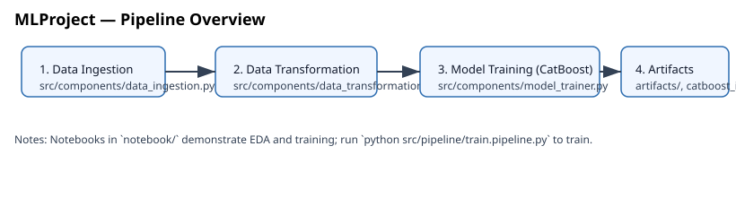

# MLProject — End-to-End Machine Learning Pipeline



## Overview

MLProject is an end-to-end example ML repository that demonstrates a structured pipeline for data ingestion, transformation, model training (CatBoost), and artifact management. It's organized to make experiments reproducible and easy to follow.

## Highlights

- Modular code under `src/` for ingestion, transformation, and model training
- Notebooks for exploration and training in `notebook/`
- Trained-model metadata and logs under `catboost_info/` and `artifacts/`
- Lightweight pipelines for training and prediction located in `src/pipeline/`

## Repository Structure

- `src/` — core application code (components, utils, pipeline entrypoints)
- `notebook/` — EDA and training notebooks
- `artifacts/` — generated artifacts (datasets, exported models)
- `catboost_info/` — CatBoost training metadata and logs

## Quickstart

1. Create and activate a virtual environment (Windows PowerShell example):

```powershell
python -m venv venv
& venv\Scripts\Activate.ps1
pip install -r requirements.txt
```

2. Explore data and experiments via notebooks:

- Open `notebook/1 . EDA STUDENT PERFORMANCE .ipynb` for data exploration
- Open `notebook/2. MODEL TRAINING.ipynb` to run training interactively

3. Run the training pipeline (scripted):

```powershell
python src/pipeline/train.pipeline.py
```

4. Run the prediction/pipeline:

```powershell
python src/pipeline/predict_pipeline.py
```

Notes: the above scripts assume the working directory is the repository root.

## Visuals

Sample visuals generated by the project live in `docs/`:

- Project overview: 
- Example plot: 

You can regenerate plots by running the notebooks or by adding plotting utilities to `src/components/` and calling them from the pipelines.

## Data

- Example CSVs are in `artifacts/` and `data/` (see `artifacts/data.csv`, `notebook/data/stud.csv`).

## Model Training

This project uses CatBoost for model training. Training artifacts and logs are stored in `catboost_info/` and `artifacts/` to aid reproducibility.

## Next steps / To-Do

- Add unit tests for pipeline components
- Add CI workflow to run linting and tests
- Parameterize training via CLI/config

## Contact

For questions or help, open an issue or contact the maintainer.
